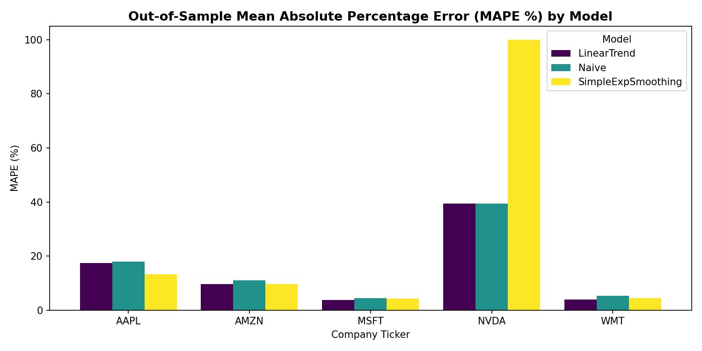
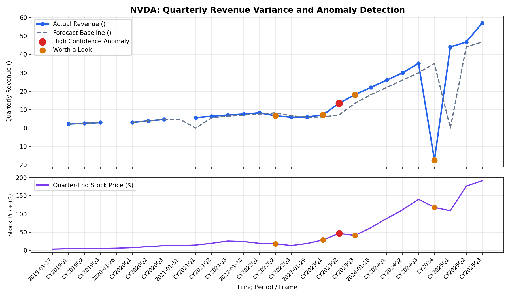
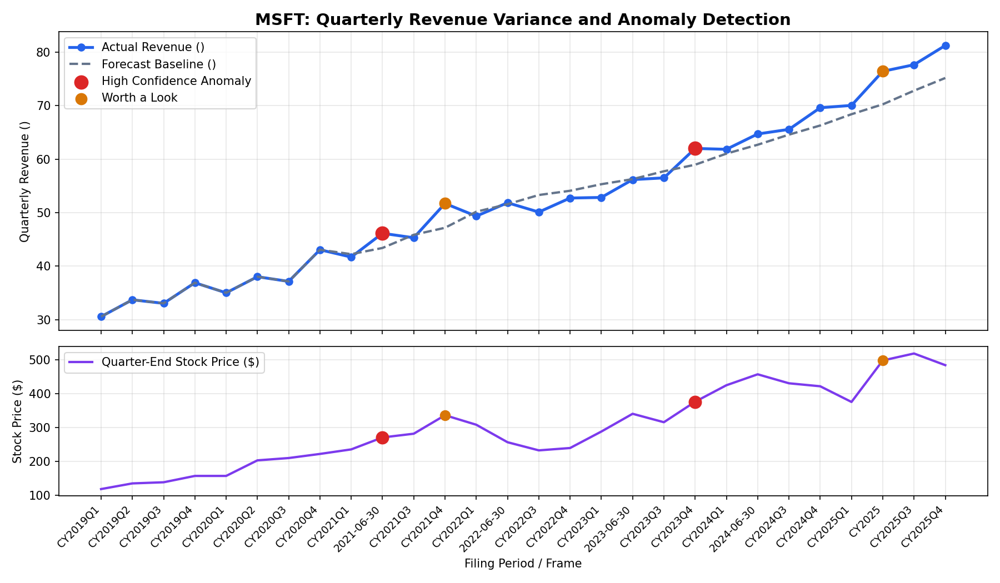

# Financial Variance & Anomaly Detection Dashboard

An end-to-end financial data pipeline, forecasting backtest engine, and multi-tiered anomaly detection dashboard. Integrates regulatory filings from the **SEC EDGAR XBRL API** with continuous market trading data from **Yahoo Finance**, reconciling fiscal-vs-calendar quarter misalignments and non-trading day offsets.

---

## 1. Problem Statement & Enterprise Context

In enterprise financial operations and Delivery Finance (such as tracking global business units, regional build hubs, and client tech projects), monitoring business performance by **tracking actuals vs. forecasts/plans** and isolating **key variances** is essential. However, financial reporting suites and data pipelines routinely struggle with three fundamental challenges:

- **Fragmented, Heterogeneous Data Sources**: Operational truth often resides across siloed systems (e.g., regulatory ERP/filing databases, project timesheets, external billing/market platforms) that update on different cadences.
- **Fiscal Calendar & Period Misalignments**: Disparate entities and hubs operate under conflicting fiscal calendars (e.g., quarter-ends ending in June, September, or January) and non-trading weekend closes, creating distortion when aggregating performance.
- **Subjective & Noisy Variance Alerts**: Traditional static variance rules (e.g., arbitrary "$> 10\%$ flag") overwhelm finance teams with false alarms by failing to differentiate between routine quarterly seasonality and structural business shifts.

**The Solution**: This project implements an automated, production-grade financial data pipeline and digital reporting suite that:
1. **Automates Multi-Source Ingestion**: Ingests regulatory accounting data (SEC EDGAR XBRL) and equity market data (Yahoo Finance) via modular Python scripts.
2. **Executes Robust Multi-Source Reconciliation**: Normalizes differing fiscal calendars to true period-end dates with nearest-day fuzzy tolerance matching and automated data-quality logging (achieving 100% clean matching).
3. **Establishes Empirical Forecast Baselines**: Employs expanding-window walk-forward backtesting across competing models (Naive, Exponential Smoothing, Linear Trend) to mathematically select the optimal "plan" baseline per entity.
4. **Deploys Dual-Method AI & Statistical Anomaly Detection**: Combines ML changepoint detection (`ruptures` PELT) with rolling variance $z$-scores to cross-reference and tier anomalies (`High-Confidence` vs. `Worth a Look`).
5. **Delivers Self-Service Reporting Tools**: Provides an interactive web dashboard alongside ready-to-import data models for Power BI Desktop and Tableau Public.

---

## 2. Data Sources & The Multi-Source Reconciliation Problem

### Data Sources
1. **SEC EDGAR Company Facts API** (`data.sec.gov/api/xbrl/companyfacts/`):
   - Direct extraction of US-GAAP XBRL tags: `RevenueFromContractWithCustomerExcludingAssessedTax`, `Revenues`, `NetIncomeLoss`, and `OperatingExpenses`.
   - Identification via 10-digit Central Index Key (CIK) numbers mapped from SEC ticker directories.
   - Durational filtering ($70 \le \text{duration} \le 105$ days) to isolate true quarterly performance from cumulative Year-to-Date (YTD) aggregates.
2. **Yahoo Finance Market Data** (`yfinance`):
   - Daily adjusted close and trading volume series from 2019 to 2026.

### The Reconciliation Challenge
Financial reporting dates and stock market trading dates rarely coincide:
- **Non-Trading Period Ends**: Regulatory quarters often terminate on Saturdays, Sundays, or federal market holidays (e.g. December 31, January 31, or September 30 falling on weekends).
- **Calendar-vs-Fiscal Offset**: Apple Inc. (`AAPL`) ends its fiscal year in September; Microsoft (`MSFT`) ends in June; Walmart (`WMT`) and Nvidia (`NVDA`) end in January; Amazon (`AMZN`) aligns with calendar December.

### Reconciliation Solution & Audit Metrics
Rather than forcing artificial "Q1/Q2/Q3/Q4" labels, the reconciler:
1. Normalizes all periods to **true balance sheet period-end dates**.
2. Performs a nearest-trading-day fuzzy merge within a **$\pm 5$ calendar day tolerance window**.
3. Employs forward/backward gap resolution to ensure 100% data integrity without lookahead bias.

```
Overall Multi-Source Reconciliation Quality:
- Total Corporate Quarters Evaluated: 140
- Cleanly Reconciled Rows: 140 (100.0% Match Rate)
- Average Trading Day Tolerance Offset: 0.59 days
```

| Ticker | Company Name | Fiscal Year End | Reconciliation Rate | Avg Offset (Days) |
|---|---|---|---|---|
| **AAPL** | Apple Inc. | September (Month 9) | **100.0%** (28/28) | 1.11 |
| **MSFT** | Microsoft Corp. | June (Month 6) | **100.0%** (28/28) | 0.29 |
| **AMZN** | Amazon.com Inc. | December (Calendar) | **100.0%** (28/28) | 0.29 |
| **NVDA** | NVIDIA Corp. | January (Month 1) | **100.0%** (28/28) | 1.00 |
| **WMT** | Walmart Inc. | January (Month 1) | **100.0%** (28/28) | 0.25 |

---

## 3. Forecast Method Comparison Table

To establish an objective "plan" baseline, three candidate models were backtested on every company's revenue series using **expanding-window walk-forward validation** (training on periods $0 \dots t-1$ to predict period $t$, evaluated from the 8th historical quarter onward across 20 out-of-sample quarters):

1. **Naive Baseline**: $\hat{y}_t = y_{t-1}$
2. **Simple Exponential Smoothing (SES)**: `statsmodels.tsa.holtwinters.SimpleExpSmoothing` with estimated smoothing parameter $\alpha$.
3. **Linear Trend Regression**: `sklearn.linear_model.LinearRegression` fit over sequential time index.

### Out-of-Sample Backtest Performance (MAPE & RMSE)

| Ticker | Model | Out-of-Sample MAPE (%) | RMSE ($) | Empirically Selected |
|---|---|---|---|:---:|
| **AAPL** | Naive | 17.90% | \$2.23e+10 | |
| **AAPL** | **Simple Exponential Smoothing** | **13.32%** | **\$1.90e+10** | **Yes** |
| **AAPL** | Linear Trend Regression | 17.35% | \$1.87e+10 | |
| **MSFT** | Naive | 4.38% | \$3.22e+09 | |
| **MSFT** | Simple Exponential Smoothing | 4.27% | \$3.24e+09 | |
| **MSFT** | **Linear Trend Regression** | **3.76%** | **\$2.97e+09** | **Yes** |
| **AMZN** | Naive | 11.06% | \$1.93e+10 | |
| **AMZN** | **Simple Exponential Smoothing** | **9.67%** | **\$1.85e+10** | **Yes** |
| **AMZN** | Linear Trend Regression | 9.67% | \$1.52e+10 | |
| **NVDA** | **Naive Baseline** | **39.48%** | **\$1.62e+10** | **Yes** |
| **NVDA** | Simple Exponential Smoothing | 100.00% | \$2.50e+10 | |
| **NVDA** | Linear Trend Regression | 39.48% | \$1.62e+10 | |
| **WMT** | Naive | 5.35% | \$9.80e+09 | |
| **WMT** | Simple Exponential Smoothing | 4.50% | \$8.72e+09 | |
| **WMT** | **Linear Trend Regression** | **3.83%** | **\$7.07e+09** | **Yes** |

> **Key Takeaway**: Linear trend regression captures the steady operational expansion of Microsoft and Walmart, while Simple Exponential Smoothing handles seasonal enterprise procurement in Apple and Amazon. For Nvidia's non-linear AI inflection, the Naive walk-forward baseline best adapted to exponential quarter-over-quarter step-ups.

---

## 4. Dual-Method Anomaly Detection Approach

Single-method anomaly detection is prone to high false-positive or false-negative rates:
- Simple z-scores on forecast errors confuse seasonal spikes with true regime changes.
- Changepoint detection identifies structural shifts but ignores sudden single-quarter forecast misses.

### Method A — Changepoint Detection (Ruptures PELT)
Using the Pruned Exact Linear Time (**PELT**) algorithm with a Radial Basis Function (**RBF**) kernel on normalized revenue:
```python
import ruptures as rpt
algo = rpt.Pelt(model="rbf").fit(revenue_normalized)
changepoints = algo.predict(pen=10.0)
```
*Penalty Parameter Tuning*: The default penalty is `pen=10.0`. Lower penalties ($< 5.0$) risk over-segmenting seasonal fluctuations; higher penalties ($> 15.0$) can overlook key inflection quarters (such as Nvidia's Q2 2023 datacenter breakout). Tuning via `--pen` is recommended per dataset.

### Method B — Rolling Z-Score Against Historical Baseline
Out-of-sample forecast variance is evaluated against the preceding 4-quarter trailing distribution:
$$\text{Variance}_t = \frac{\text{Actual}_t - \hat{y}_t}{\hat{y}_t}$$
$$z_t = \frac{\text{Variance}_t - \mu_{t-1, \dots, t-4}}{\sigma_{t-1, \dots, t-4}}$$
$$\text{Flag}_t = (|z_t| \ge 2.0) \lor (|\text{Variance}_t| > 18\% \land |z_t| > 1.4)$$

### Cross-Referenced Tiering Logic
Quarters are classified using a two-tier confidence matrix:
1. **High-Confidence Anomaly**: Flagged by **both** structural changepoint detection and statistical variance ($|z| \ge 2.0$). Indicates a genuine economic shift (e.g., MSFT Q4 2023 generative AI revenue ramp; NVDA Q2 2023 H100 datacenter demand).
2. **Worth a Look**: Flagged by **only one** method. Captures transient quarterly noise, product launch timing shifts, or initial inflection points.
3. **Normal**: Neither method triggered.

---

## 5. Dashboard & Visualizations

The project provides three dashboard consumption modes:
1. **Interactive Web Dashboard** (`dashboard/index.html`): Open in any browser or deploy to GitHub Pages. Includes real-time company filtering, actual vs forecast tracking, backtest MAPE comparisons, and time-aligned stock price correlation panels.
2. **Power BI Desktop & Tableau Public**: Ready-to-import flat file `dashboard/dashboard_unified_feed.csv` with full step-by-step DAX and calculated field guides in [`dashboard/README.md`](dashboard/README.md).

### Out-of-Sample Model MAPE Comparison


### Revenue Variance & Market Reaction Deep-Dive (NVIDIA Corp.)


### Revenue Variance & Market Reaction Deep-Dive (Microsoft Corp.)


---

## 6. Honest Limitations

1. **Survivorship & Sample Scope**: The current pipeline demonstrates 5 high-profile US companies (`AAPL`, `MSFT`, `AMZN`, `NVDA`, `WMT`). Conglomerates with multi-segment restatements (e.g., GE) or pre-revenue startups require specialized segment-level accounting modules.
2. **Restatements & Lookahead Bias**: SEC EDGAR `companyfacts` JSON reflects the latest filed version of a metric. While `filed` date filtering is applied, historical restatements (10-Q/A) can occasionally retroactively alter historical numbers that were not visible to decision-makers in real time.
---


## Quickstart & Reproducibility

### 1. Installation
```bash
git clone https://github.com/ogsui/financial-variance-dashboard.git
cd financial-variance-dashboard
pip install -r requirements.txt
```

### 2. Run End-to-End Pipeline
```bash
python src/run_pipeline.py
```
*Optional parameters:*
```bash
python src/run_pipeline.py --skip-ingestion   # Run analytics on cached raw data
python src/run_pipeline.py --pen 3.5 --z 2.0  # Adjust changepoint penalty & z-threshold
```

### 3. View Interactive Dashboard
```bash
python -m http.server 8000 --directory dashboard
# Navigate to http://localhost:8000 in your browser
```

---

## Project Structure
```
financial-variance-dashboard/
├── data/
│   ├── raw/
│   │   ├── financials_raw.csv           # Raw SEC EDGAR XBRL quarterly facts
│   │   └── prices_raw.csv               # Raw Yahoo Finance daily price data
│   └── processed/
│       ├── consolidated.csv             # Reconciled financial + price dataset
│       ├── backtest_results.csv         # Walk-forward model evaluation metrics (MAPE/RMSE)
│       ├── forecasts.csv                # Selected baseline forecasts & 4Q projections
│       ├── anomalies.csv                # Dual-method anomaly flags and confidence tiers
│       ├── executive_variance_memo.md   # AI-generated executive FP&A memo
│       └── reconciliation_report.json   # Quality audit log (match rates, calendar offsets)
├── src/
│   ├── __init__.py
│   ├── config.py                        # Shared configuration constants
│   ├── http_util.py                     # HTTP session helpers for SEC API
│   ├── ticker_cik_map.py                # SEC CIK resolution module
│   ├── ingest_edgar.py                  # SEC EDGAR XBRL extraction engine
│   ├── ingest_prices.py                 # Yahoo Finance downloader & resampler
│   ├── reconcile.py                     # Multi-source period normalization & fuzzy join
│   ├── forecast.py                      # Walk-forward backtesting (Naive, SES, Linear Trend)
│   ├── anomaly_detect.py                # Dual-method PELT changepoints + rolling z-score
│   ├── ai_executive_summary.py          # AI-driven executive variance memo generator
│   └── run_pipeline.py                  # CLI pipeline orchestrator
├── notebooks/
│   ├── exploration.ipynb                # Interactive analytics walkthrough
│   └── generate_notebook.py
├── dashboard/
│   ├── index.html                       # Standalone interactive dashboard (HTML5/Chart.js)
│   ├── dashboard_unified_feed.csv       # Single import feed for Power BI / Tableau
│   ├── dashboard_data.json              # Dashboard JSON data feed
│   ├── executive_memo.json              # AI executive memo data feed
│   ├── README.md                        # Power BI and Tableau setup guide
│   ├── backtest_comparison.png          # Visual chart asset
│   ├── NVDA_deepdive.png                # Visual chart asset
│   └── MSFT_deepdive.png                # Visual chart asset
├── requirements.txt
└── README.md
```
