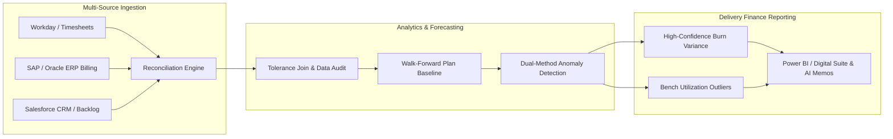

# Enterprise Translation: Scaling BCG X Delivery Finance Operations

> **Note**: This document is extracted from the main project to serve as application-specific context.
> The public repository README remains company-agnostic.

This pipeline's architecture directly mirrors the core responsibilities of enterprise delivery finance teams, specifically supporting **BCG X Delivery** leaders in managing global business units, tracking project codes, and scaling near-shore capability hubs:

## Direct Mapping to Delivery Finance Workflows

1. **Multi-Source ERP & Timesheet Consolidation**:
   - *Project Implementation*: Reconciled quarterly SEC XBRL facts with daily market pricing across conflicting fiscal calendars.
   - *Delivery Finance Translation*: Consolidates monthly billing milestones (SAP/ERP) with weekly consultant/engineer timesheets (Workday), contracted billing rates, and project codes across 80+ cities.

2. **Monitoring Actuals vs. Plan Across Capability Hubs**:
   - *Project Implementation*: Walk-forward backtesting selected empirical revenue models (3.7% MAPE for linear trends).
   - *Delivery Finance Translation*: Replaces static quarterly targets with empirical run-rate forecasts across regional X Build hubs (North America, EMEA, LATAM near-shore), tracking actual billable revenue against project backlog.

3. **Project Code & Timesheet Burn-Rate Anomaly Detection**:
   - *Project Implementation*: Cross-references structural PELT changepoints with rolling z-scores (|z| ≥ 2.0) to flag high-confidence anomalies.
   - *Delivery Finance Translation*: Flags project codes where developer burn rate suddenly decouples from historical delivery velocity—alerting leadership to scope creep, unbilled hours, or pending timesheet corrections before month-end close.

4. **AI-Driven Executive Variance Commentary**:
   - *Project Implementation*: Implemented `ai_executive_summary.py` to synthesize quantitative flags into structured FP&A memos.
   - *Delivery Finance Translation*: Automates the generation of executive commentary for practice leaders, summarizing revenue impact, staffing bench shifts, and project win ramps.
